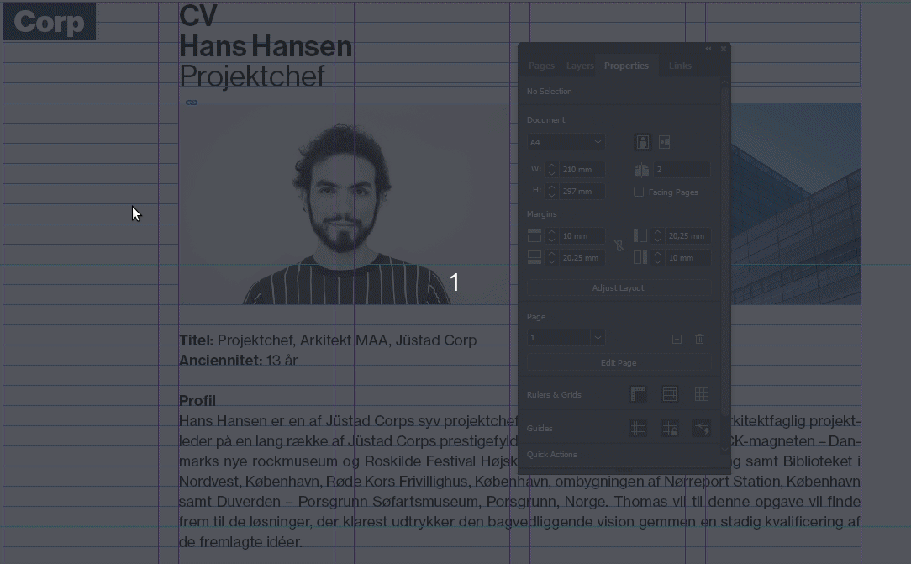

# Inkludér billede i skabelonen

[⟵](./README.md)

For at sikre at vi får alle indstillinger omkring billedet ind i skabelonen, skal billedet inkluderes i skabelonen (`Embed`). Orbit eksporterer kun til InDesign formattet `.idml`, som ikke tager linkede billeder med i den resulterende skabelon. Derfor skal man huske at embedde alle billeder i dokumentet inden skableonen eksporteres til `.idml` formatted.

[Konvertér til `.idml`](./ExportIdml-da_DK.md)

[⟵](./README.md)
