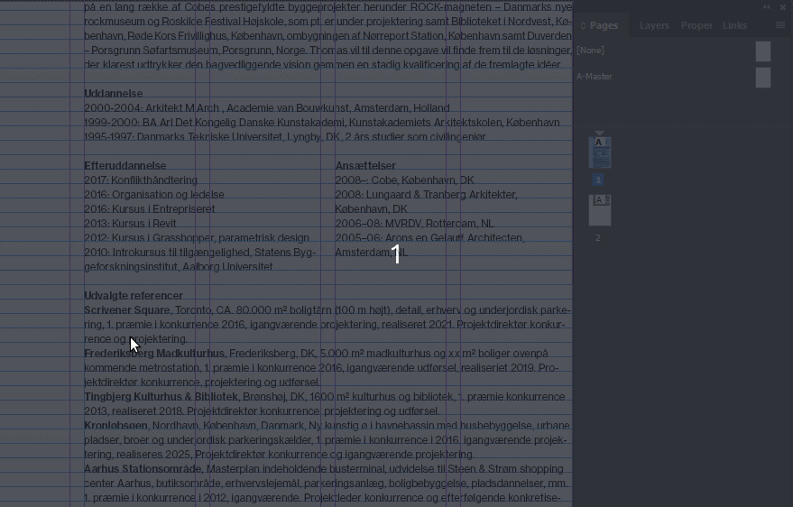
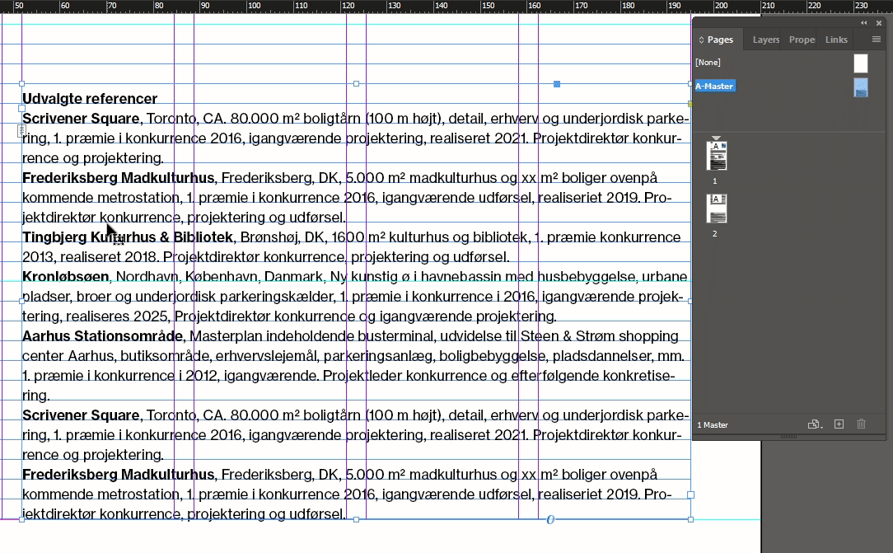
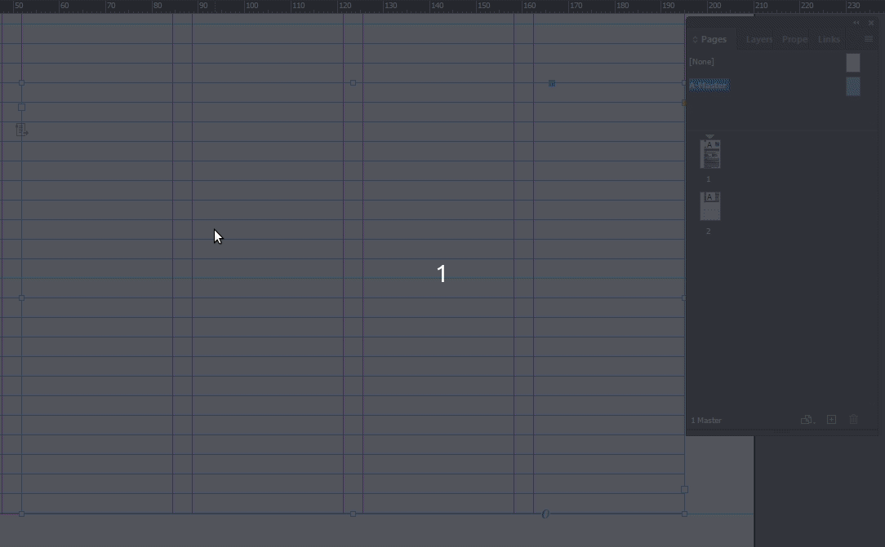
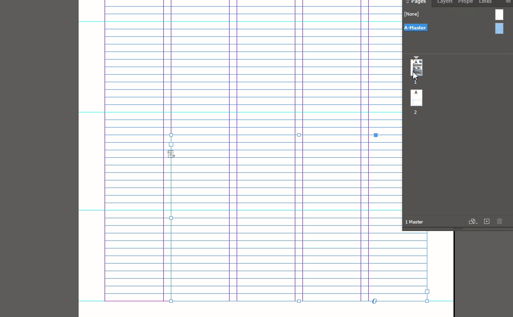

# Konvertér tekstboks til primær tekstboks

[⟵](./README.md)

## Kopiér tekstbokesen til `A-Master`

1. Markér textboksen som hvis indhold vi ønsker der skal overflow til næste side.
2. Højreklik og vælg `Copy`.
3. Dobbeltklik på `A-master` i `Pages` panelet for at skifte til master spread'et.
4. Højreklik midt på siden og vælg `Paste in Place`.

## Lav tekstboks til primær tekstboks (`Primary Textbox`)

1. Dobbeltklik på teksboksen.
2. Markér alt tekst indholdet.
3. Slet teksten.
4. Tryk `Esc` knappen for at få fokus til tekstboks rammen.
5. Klik på det lille papir ikon så der kommer en lille pil frem.

## Anvend den `Master spread` på siden

1. Højre klik på side `1`.
2. Vælg `Apply Master to Pages`.
3. Verificere at der står `A-Master` ud for `Apply Master:`.
4. Klik `OK`.

## Flyt den oprindelige tekstbok

1. Dobbelt klik på side `1`.
2. Flyt tekstboksen ud til siden.
3. Markér og kopiér indholdet.
4. Sæt det ind i teksboksen fra `A-Master`.
5. Slet den gamle tekstboks.

[⟵](./README.md)
