# Automatisk oprettelse af sider efter behov

[⟵](./README.md)

## Kopiér tekstboksen til `A-Master`

1. Markér textboksen som hvis indhold vi ønsker der skal overflow til næste side.
2. Højreklik og vælg `Copy`.
3. Dobbeltklik på `A-master` i `Pages` panelet for at skifte til master spread'et.
4. Højreklik midt på siden og vælg `Paste in Place`.

## Lav tekstboks til primær tekstboks (`Primary Textbox`)

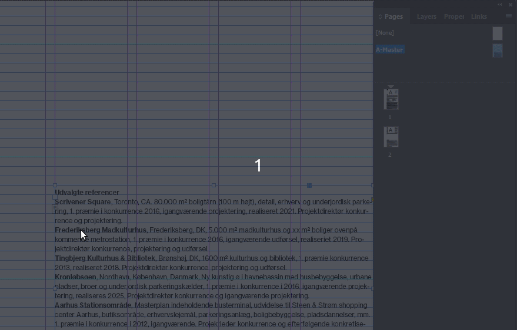

1. Dobbeltklik på teksboksen.
2. Markér alt tekst indholdet.
3. Slet teksten.
4. Tryk `Esc` knappen for at få fokus til tekstboks rammen.
5. Klik på det lille papir ikon så der kommer en lille pil frem.

## Anvend den `Master spread` på siden

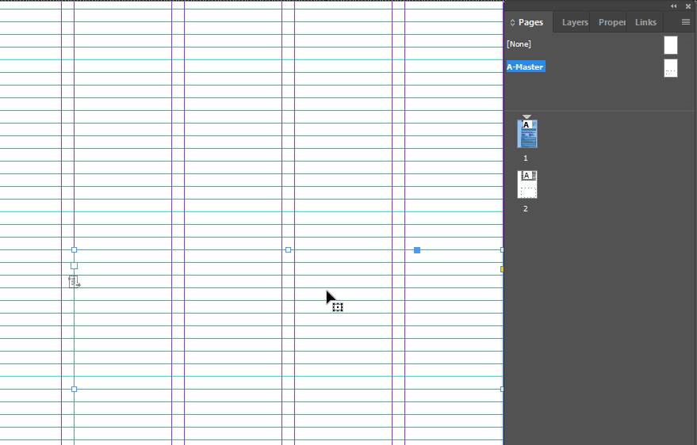

1. Højre klik på side `1`.
2. Vælg `Apply Master to Pages`.
3. Verificere at der står `A-Master` ud for `Apply Master:`.
4. Klik `OK`.

## Flyt den oprindelige tekstbok

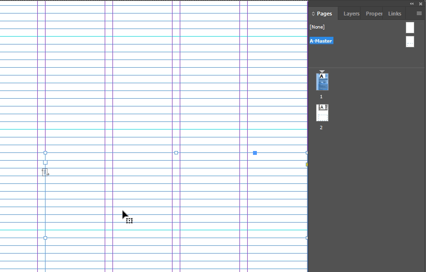

1. Dobbeltklik på siden vi kopierede tekstboksen fra.
2. Klik på tekstboksen.
3. Flyt tektboksen ud af siden.
4. Verificér at den primære tekstboks fra `A-Master` er tilgængelig på siden.

## Opret ny `Master Spread` til side `2`, `3`,...

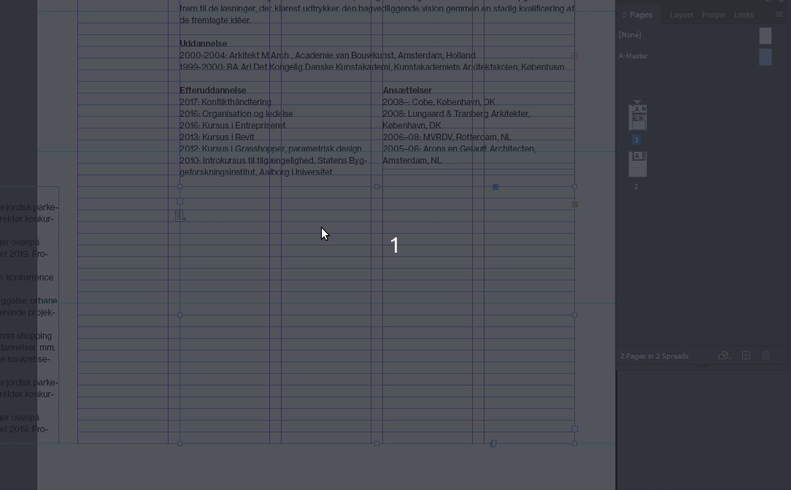

1. Højre klik på `A-Master`.
2. Vælg `Duplicate Master Spread "A-Master"`

## Kopiér tekstbox fra side `2` til `B-Master`

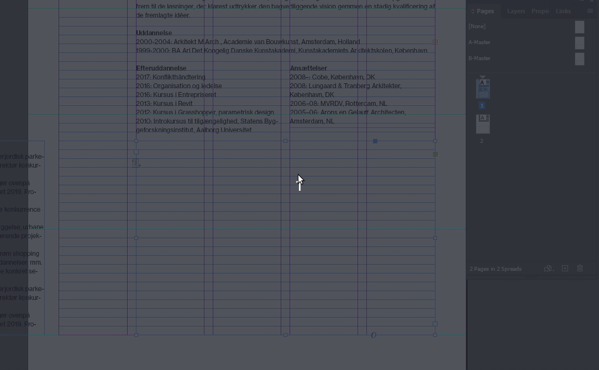

1. Scroll ned til side `2`.
2. Højreklik på tekstboksen teksten skal overflowe ned i og vælg `Copy`.
3. Dobbeltklik på `B-Master`.
4. Højreklik på siden og vælg `Paste in Place`.

## Lav separat tekstboks til statisk overskrift

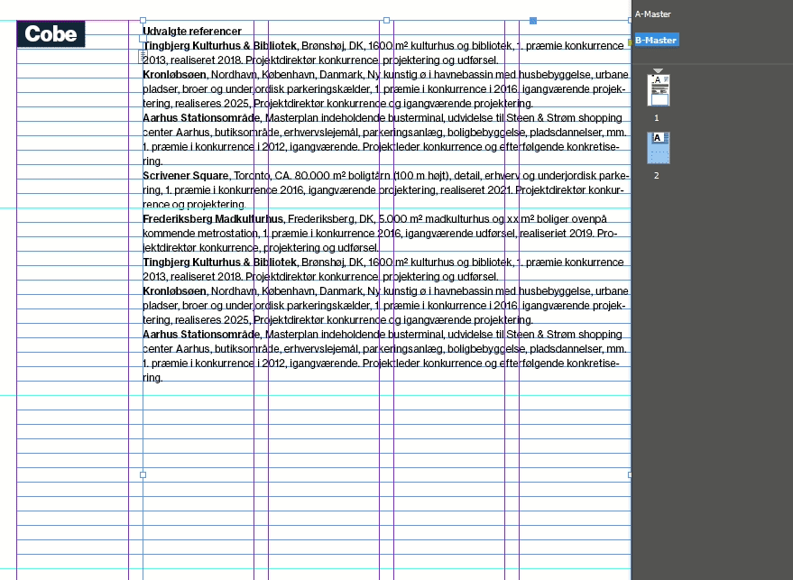

1. Dobbeltklik på teksboksen.
2. Markér alt tekst indholdet som ikke er overskriften.
3. Slet teksten.
4. Tilpas tekstboksrammen så den kun dækker overskrifeten.

## Indsæt tekstboks til dynamisk indhold

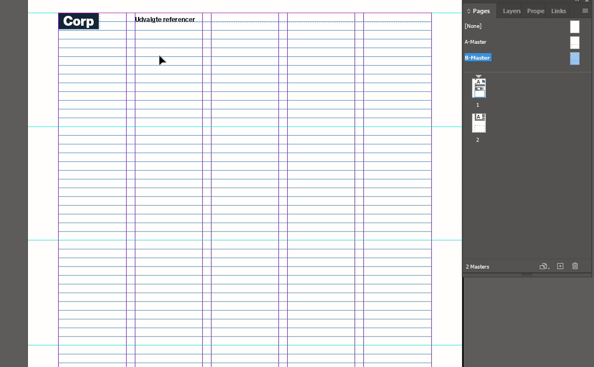

1. Højreklik på siden og vælg `Paste in Place`.
2. Ændre teksboksrammen størrelse til at flugte med overskriften.
3. Markér alt tekst indholdet.
4. Slet teksten.
5. Tryk `Esc` knappen for at få fokus til tekstboks rammen.
6. Klik på det lille papir ikon så der kommer en lille pil frem.

## Anvend `B-Master` på side `2`

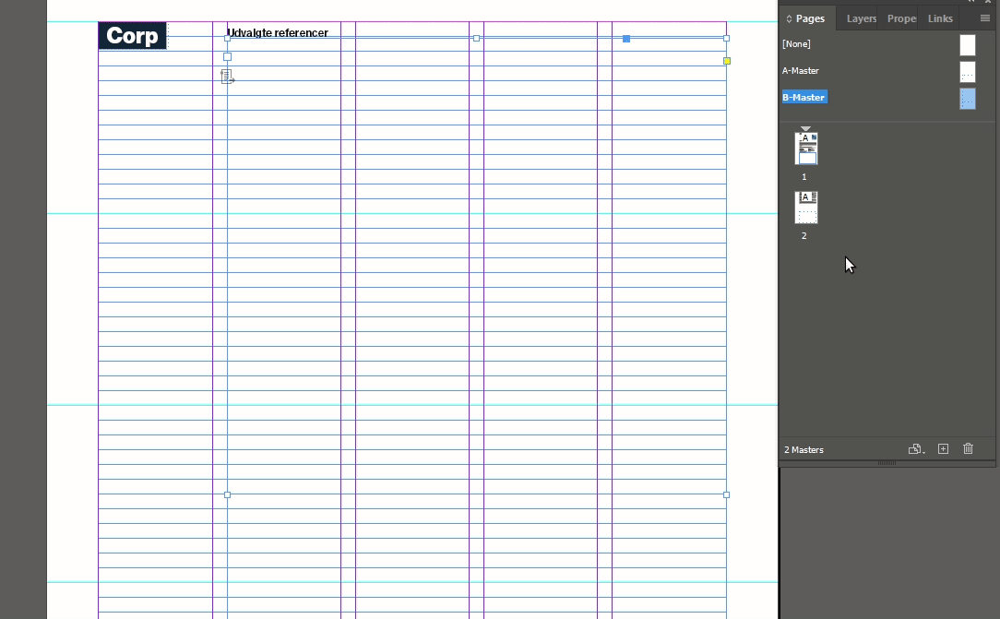

1. Højre klik på `Page 2`.
2. Vælg `Apply Master to Pages`.
3. Verificere at der står `B-Master` ud for `Apply Master:`.
4. Klik `OK`.

## Flyt den oprindelige tekstbok på side `2` væk

1. Dobbeltklik på side `2`.
2. Klik på tekstboksen.
3. Flyt tektboksen ud af siden.
4. Verificér at den primære tekstboks fra `B-Master` er tilgængelig på siden.

## Link tekstboksene sammen

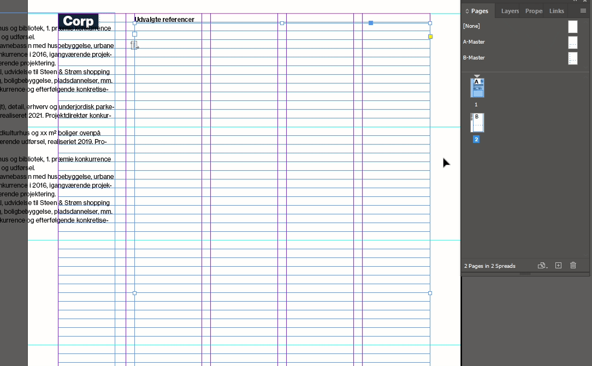

1. Klik på den lille boks under øverste venstre hjørne af tesktboksen på side `2`.
2. Scroll op til side `1` og klik på tektsboksen vi vil kæde sammen med.

## Kopíer teksten fra tekstboksene som er flyttet

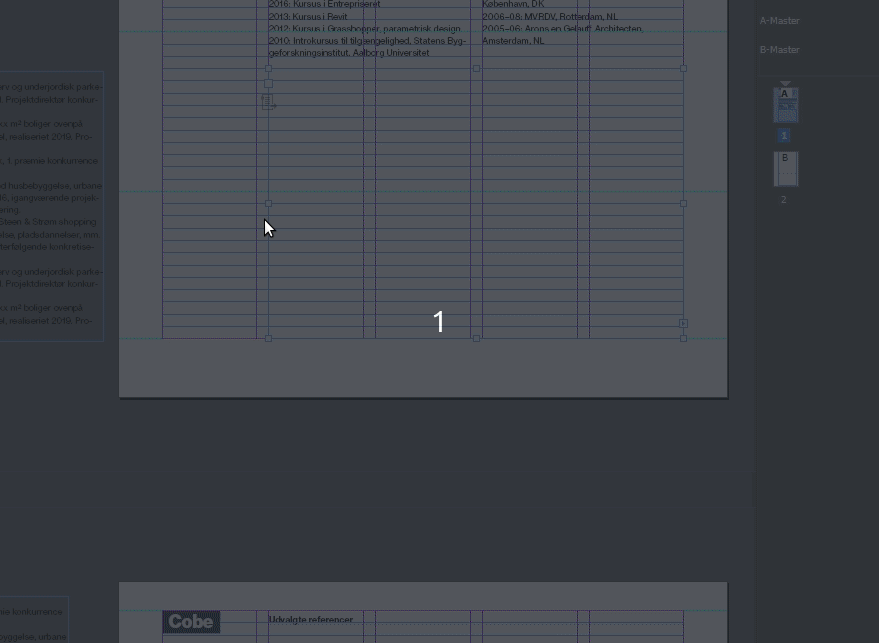

1. Klik indeni tekstboksen udenfor siden.
2. Markér alt teksten.
3. Højre klik på teksten og vælg `Copy`.
4. Klik på tekstboksen på side `1`.
5. Højreklik indeni i tekstboksen og vælg `Paste`.

## Oprydning

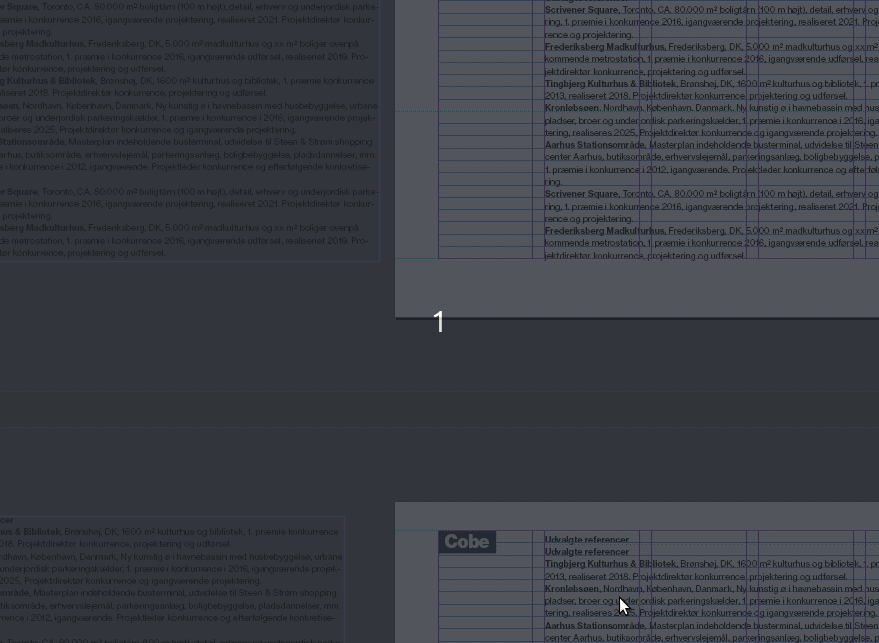

1. Klik på tekstboksen ved siden af side `1`.
2. Tryk på `Delete` tasten på tasteturet.
3. Gør det samme for tekstboksen ved siden af side `2`.
4. Fjern overskriften fra indholdet vi lavede statisk i `B-Master`.

## Verificér tekstoverflow effekten

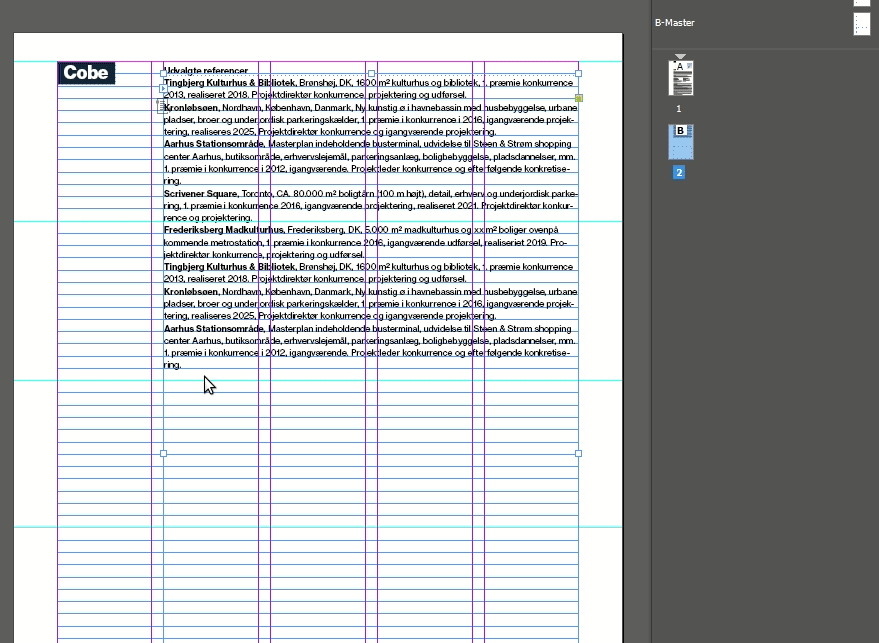

1. Markér teksten der går ud på siden `2`.
2. Kopiér teksten (højreklik -> `Copy` / `Ctrl + C`)
3. Indsæt det nogle gange indtil der opstår en side `3`.
4. Verificér at side `3` bruger `B-Master`.
5. Fortryd `Ctrl + Z` ændringerne indtil vi er tilbage til kun 2 sider igen.

Vigtigt: husk at du maksimalt kan have 10 sider i ét spread. Det er en begrænsning i InDesign.

[⟵](./README.md)
