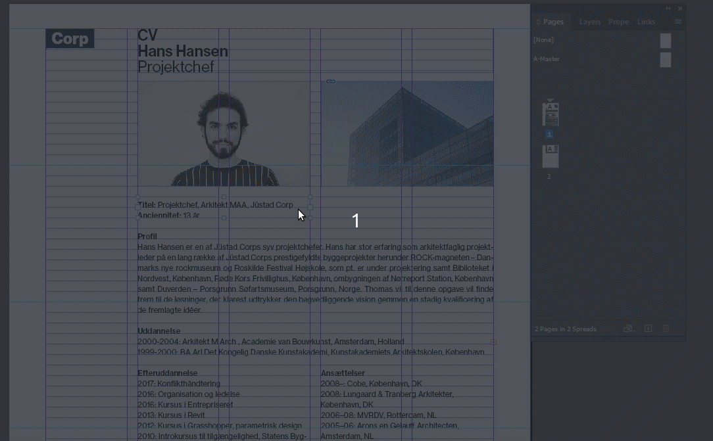

# Sikre bredden på tekstboksen er klar til dynamisk indhold

[⟵](./README.md)

Sørg for at tekstboksen ikke kun er designet til det konkrete indhold, men være opmærksom på at indholdet kan have variabel længde, så derfor gør tekstboksene så store som muligt, uden at ødelægge det underlæggende design/layout.

[⟵](./README.md)
