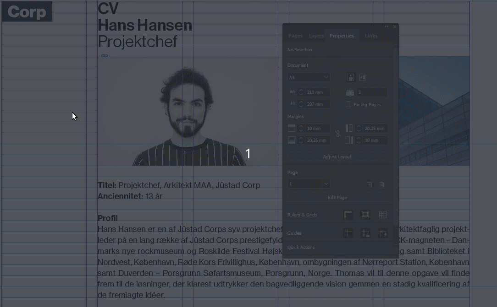

# Include image in the template

[⟵](../README.md)

To ensure that all settings related to the image are included in the template, the image must be embedded in the template (`Embed`). Orbit only exports to the InDesign format `.idml`, which does not include linked images in the resulting template. Therefore, remember to embed all images in the document before the template is exported to `.idml` format.

[Konvertér til `.idml`](./ExportIdml.md)

[⟵](../README.md)
