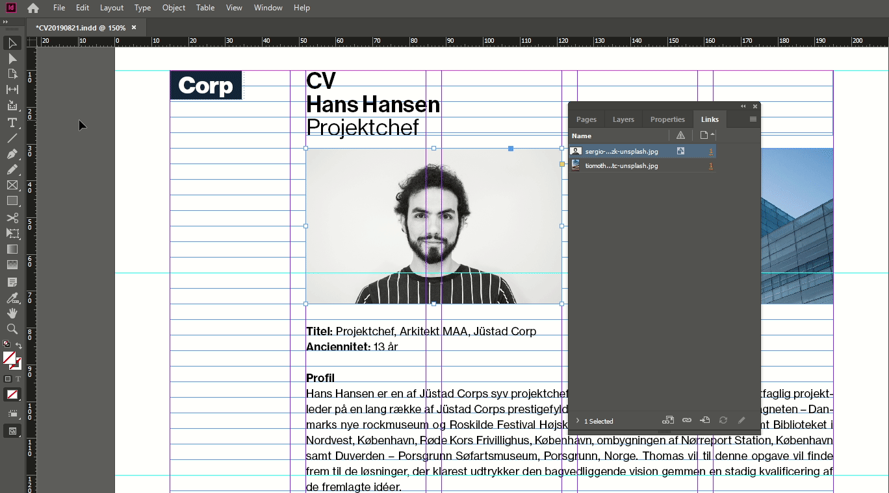

# Convert to `.idml` format

[⟵](../README.md)

Orbit only supports the InDesign format `.idml`, so once all other considerations have been addressed to make it a good template for dynamic content, the template must be converted to `.idml` format.

[⟵](../README.md)
