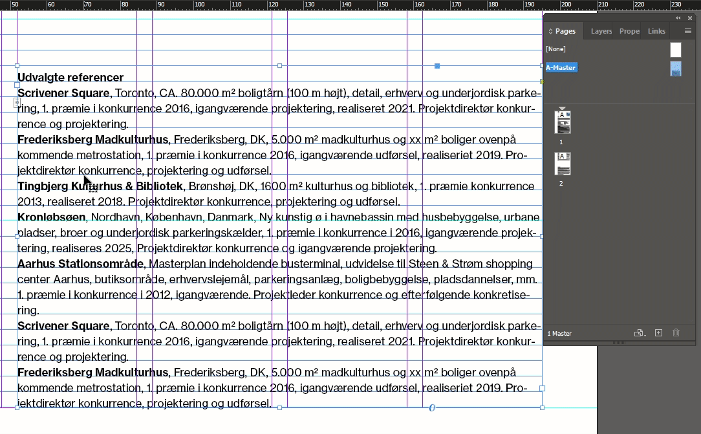
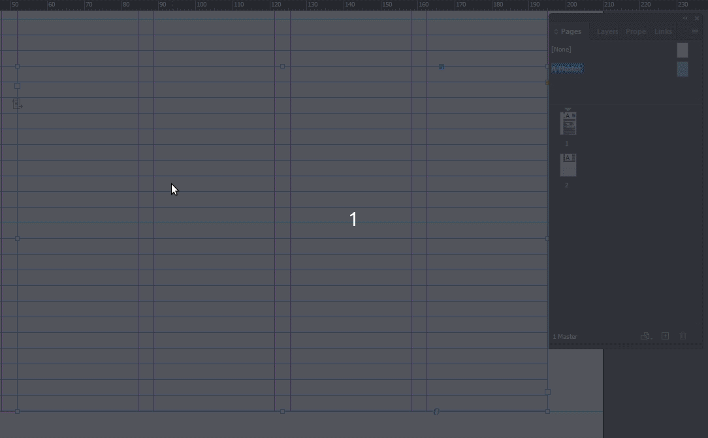
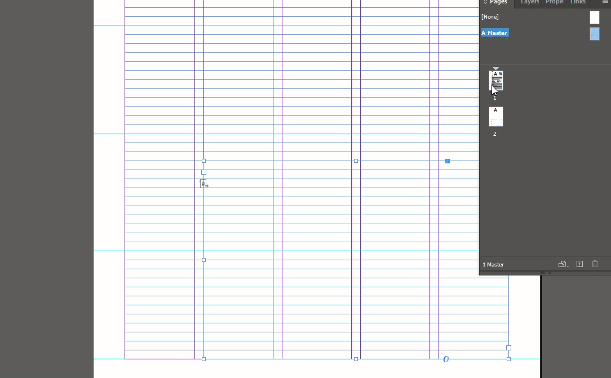

# Convert text box to primary text frame

[⟵](../README.md)

## Copy the text box to `A-Master`

1. Select the text box whose content you want to overflow to the next page.
2. Right-click and choose `Copy`.
3. Double-click `A-Master` in the `Pages` panel to switch to the master spread.
4. Right-click in the middle of the page and choose `Paste in Place`.

## Make the text box a primary text frame (`Primary Textbox`)

1. Double-click the text box.
2. Select all the text content.
3. Delete the text.
4. Press the `Esc` key to move focus to the text frame.
5. Click the small paper icon so that a small arrow appears.

## Apply the `Master spread` to the page

1. Right-click page `1`.
2. Select `Apply Master to Pages`.
3. Verify that `A-Master` is set next to `Apply Master:`.
4. Click `OK`.

## Move the original text box

1. Double-click page `1`.
2. Move the text box aside.
3. Select and copy the content.
4. Paste it into the text box from `A-Master`.
5. Delete the old text box.

[⟵](../README.md)
