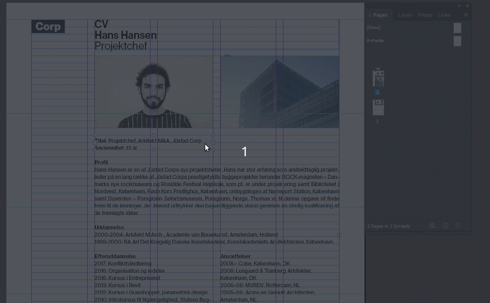

# Ensure the width of the text box is ready for dynamic content

[⟵](../README.md)

Make sure that the text box is not only designed for the specific content, but also takes into account that the content may vary in length. Therefore, make the text boxes as large as possible without breaking the underlying design/layout.

[⟵](../README.md)
